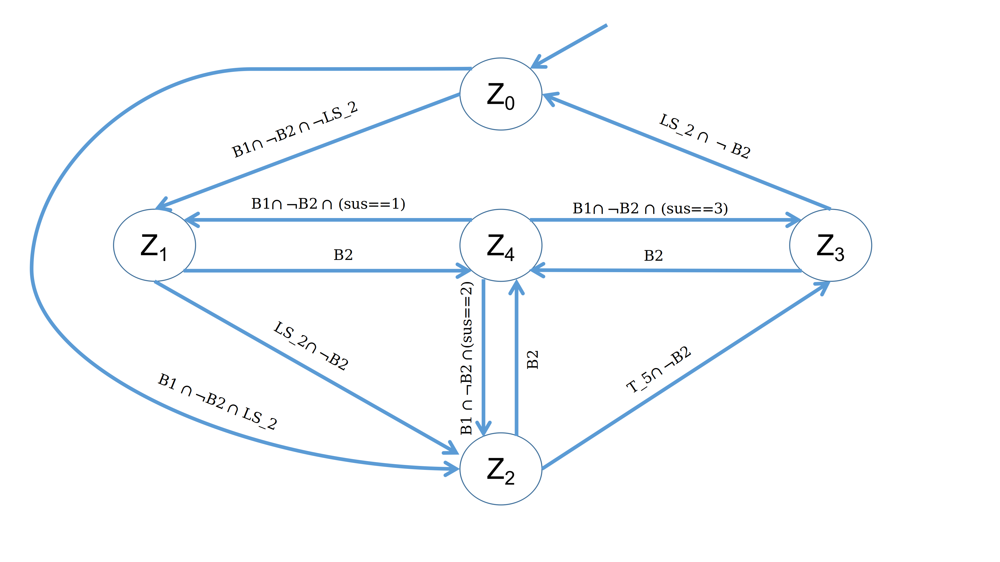
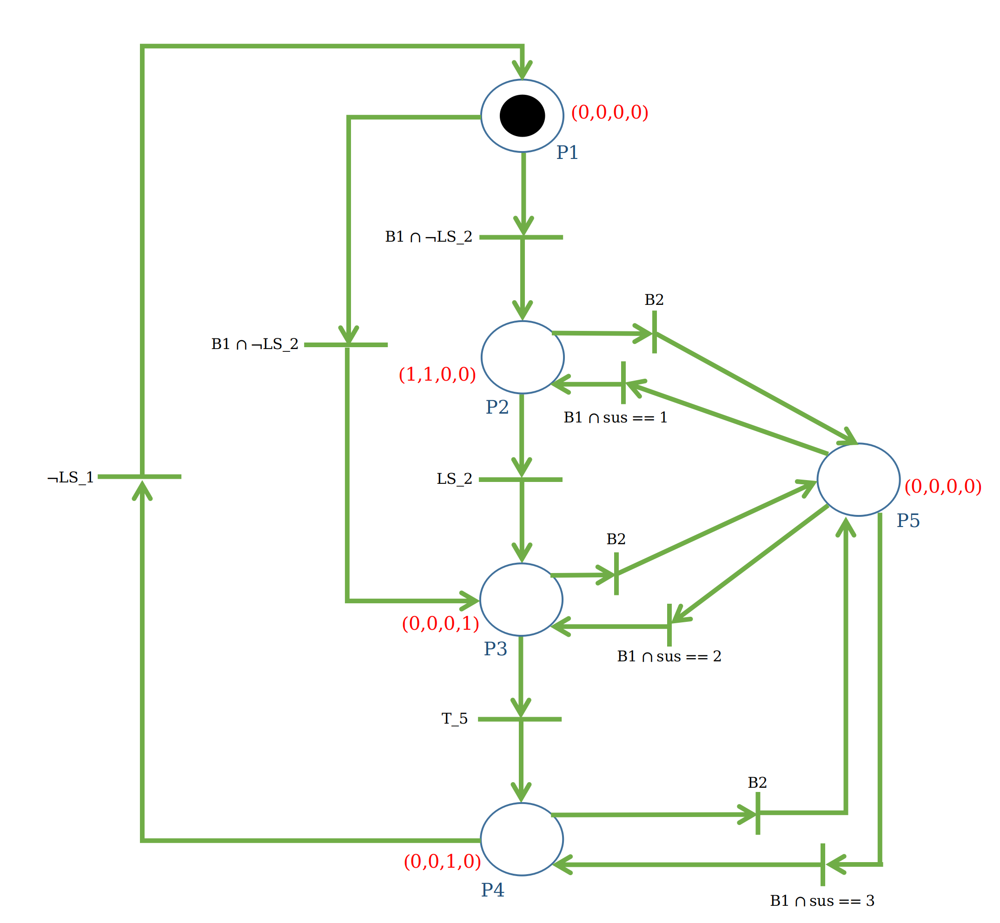

## Mixing Tank Controller- Design

| Signal                | Symbol        | I/O   | Logic Statement                   |
| --------------------- | ------------- | ----- | ---------------------             |
| Start Button          | B1            | I     | B1=1; Start                       |
| Stop Button           | B2            | I     | B2=1; Stop                        |
| Timer                 | T_5           | I     | T_5=1; 5 Minutes elapsed          |
| Valve 1 Actuator      | V1            | O     | V1= 1; Open Valve 1               |
| Valve 2 Actuator      | V2            | O     | V2= 1; Open Valve 2               |
| Valve 3 Actuator      | V3            | O     | V3= 1; Open Valve 3               |
| Mixer Motor Actuator  | M             | O     | M= 1; Turn ON Mixer               |
| Level Switch 1        | LS_1          | I     | LS_1= 0; Tank level < 10%         |
| Level Switch 2        | LS_2          | I     | LS_2= 1; Tank level > 95%         |
| Tank Liquid Level     | T_L_L         | I     | T_L_L= (int);                     |
| Mix Percentage        | M_P           | I     | M_P= (int);                       |
| Error                 | err           | I     | err= 1; Plant error               |
| Suspend               | sus           | -     | sus= (int); state before pause    |

[Plant Model](../../../plants/modelling/mixing_tank)

------------------------------------------------------------------------------------  
### Finite State Automata Model

#### States
- Z0: Initialization. All outputs are low.  
- Z1: Filling. **V1** and **V2** are high. **sus** is set to 1.  
- Z2: Mixing. **M** is high. Timer **T_5** is set. **sus** is set to 2.   
- Z3: Draining. **V3** is high. **sus** is set to 3.  
- Z4: Stopped. All outputs are low.  

------------------------------------------------------------------------------------  
### SignalInterpreted Petri Net Model

  

Outputs: (V1, V2, V3, M)

------------------------------------------------------------------------------------  
### Specifications
1- If **Start Button** is pressed, open **Valve 1** and **Valve 2** to fill the tank.  
2- When the tank level is > 95%, close both valves 1 and 2, then start the **Mixer Motor**.  
3- After 5 minutes, turn off the **Mixer Motor** and drain the tank by openening **Valve 3**.  
4- When the tank level is < 10%, close **Valve 3**.  
5- If **Stop Button** is pressed or an error is detected on the plant at any time, suspend 
    the current operation. This operation is resumed whenever the **Start Button** is pressed again.  

[Controller Logic Verification](../../validation_and_verification/mixing_tank.smv)

------------------------------------------------------------------------------------  
### References
1- Logic Control Lecture Notes- Lehrstuhl für Automatisierungstechnik, Technische Universität Kaiserslautern. Prof. Dr. Ping Zhang.